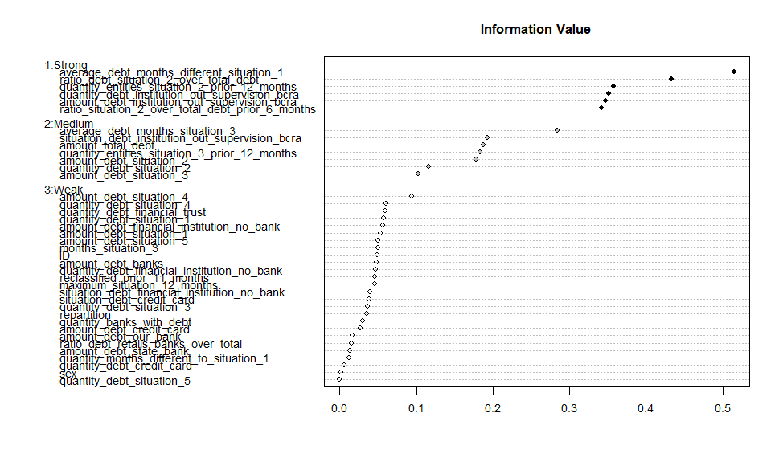
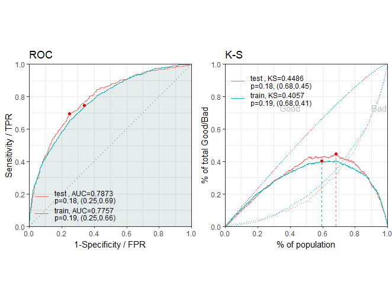
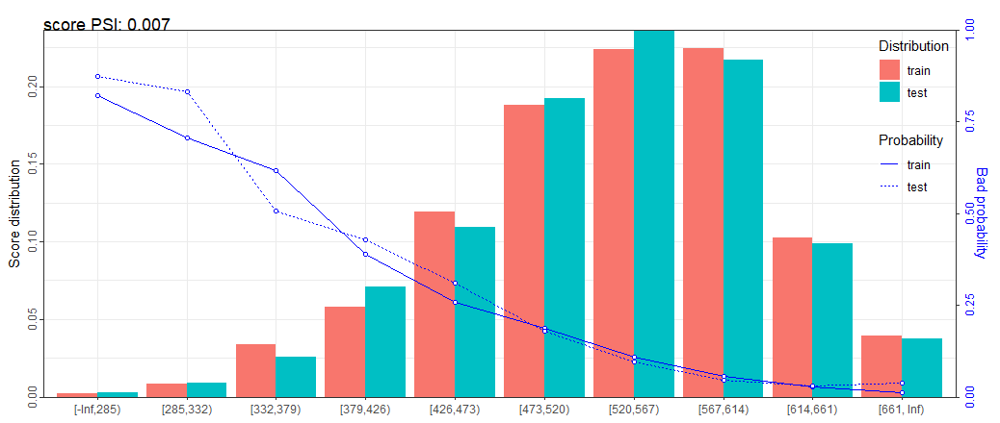
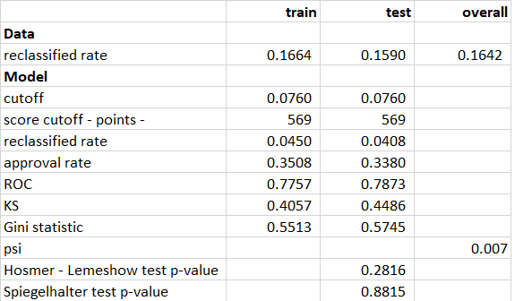

```{r setup, include=FALSE}
knitr::opts_chunk$set(echo = FALSE)
```

# Objetives 

The bank for which we do this work is active in the loans with repayment through payroll deductions a employees of the state goverment. Those employees have legal job stability, so is very difficult that an employee is fired. Given both, job stability and the sure payment, the default probability is very low. But as we will see in last paragraph of *Debtor classification* section below, it is posible that as only one-level discrepancy is allowed in relation to the information submitted by financial institutions to the Credit Information Data Base, if there is a greater discrepancy between the rating of the bank and the lower classification awarded by at least two other banks, and total loans from such banks account for 40% or more of the total informed, the our bank will be required to reclassify the debtor to at least the level immediately above from registering the highest level of indebtedness with the comparison institutions. In practical terms, the bank will must provisioning even though the debtor is normal on its books

The objetive of this project is pick the variables that predict if a debtor whose classification differs from ours, but is not yet required to be reclassified for not fulfilling some of the three conditions set forth in the regulations:  

- a  discrepancy of two or more notches  between the rating of the bank and the lower classification awarded  

- by at least two other banks, and  

- the total loans from such banks account for 40% or more of the total informed,


complies them, within the year in which the data was selected.

The bank also requires build a score system and pick a cutoff that reach a reclassified rate lesser than 0.045, but allowing high approval rate.

# Regulations 
##  Debtor classification, provisioning and collateral guarantees
### Debtor classification

Regulations establish guidelines for classifying debtors from the point of view of their credit quality and compliance with their commitments, according to the evaluation performed for that purpose by the financial institution.

- The guidelines vary depending on whether commercial consumer or housing loans are involved.
Commercial loans of up to 40% of the determined amount (*) may be considered, for classification purposes,
as consumption loans and treated as such at the bank's discretion.  

- Debtors and all their loans are included in one of six categories or situations of decreasing credit quality:

| Commercial Loans | Consumer or Housing Loans | Arrears |
| --- | --- |--- |
| 1. Normal [^1] | | up to 31 days |
| 2. Special follow-up [^2] |2. Low risk |up to 90 days
| 3. Substandard| 3. Middle risk| up to 180 days
| 4. High Insolvency Risk [^3]| 4. High risk |up to 1 year
| 5. Unrecoverable| | more than a year| 
| 6. Unrecoverable based on technical criteria[^4]|  | | 

[^1]: <sub> In the case of consumer or housing loans, current account overdrafts are considered to be performing until 61 days have elapsed from the date granted.
[^2]: <sub> Commercial loans in situation 2 are divided into: a) under observation, include those debtors up to 90 days past due in situations that if not controlled or corrected in a timely manner, could compromise their repayment capacity, and b) those under negotiation or with refinancing agreements, which include debtors that although unable to pay their obligations under the agreed conditions, have declared their intention of refinancing their debts no later than 60 days after becoming past due.
[^3]: <sub> This category includes debtors that have filed for creditor protection or an out-of-court preventive measure, or for which payment has been demanded in court. In the case of the consumer portfolio, debtors that have filed for creditor protection or are covered by out-of-court measures can record arrears of up to 540 days.
[^4]: <sub> This category includes debtors with arrears in excess of 180 days that are customers of banks that have been wound up or had their license revoked by the BCRA, residual entities of privatized banks, or trusts of which SEDESA is a beneficiary.</sup>
  
- The basic criterion for evaluation is the repayment capacity in relation to the debt or the commitments that are the object of the financial institution guarantee. For the commercial portfolio, evaluation is made on the basis of repayment capacity and debtor cash flows, and in the case of consumer and housing loans it is based on debt payment compliance and the legal status of the debtor. Indicators used in the case of commercial loans include liquidity, financing structure, compliance with payment of obligations, quality of management and administration, IT systems, prospects for the customer's business sector, its position within the sector, its legal standing and the existence of refinancing or debt discounts. The evaluation criteria for the consumer and housing portfolios is exclusively objective - the degree of compliance with obligations and the legal situation of the debtor.  

- When loans are fully collateralized by preferred class A collateral, evaluation of repayment capacity is not required.  
  
- Minimum classification frequency: As a general rule, this should be annual. Nevertheless, classification should take place: 

- during the course of each quarter for customers whose debts are equivalent to 5% or more of the financial institution's RC; 

- during the course of each half-year term in the case of customers whose debts range from 1% (or the equivalent to the determined amount [^5], whichever is lower) to less than 5% of the financial institution's RC. 

In addition, the bank should review a debtor's situation when any of the following circumstances take place: 

a) when a debtor has debts equivalent to at least 10% of the total notified to the Credit Information Debtor Base in another financial institution, and that institution lowers the customer's rating on the mentioned database;

b) when there are changes to any of the objective classification criteria (arrears or legal situation);
      
c) when there is more than a one-level discrepancy between the classification assigned by the financial institution and at least two other institutions, and certain requirements have been met.

[^5]: <sub> The maximum value of total annual sales for the "micro" category belonging to the "commercial" sector pursuant to the regulations on "Determination of the condition of MiPyMEs" amounts to $ 15,800,000.</sup>

Re-appraisal must be carried out promptly in the case of customers with debts totaling 1% or more of the
financial institution's RPC or the equivalent to the determined amount, whichever is lower.

**Only one-level discrepancy is allowed in relation to the information submitted by financial institutions to
the Credit Information Data Base. If there is a greater discrepancy between the rating of the bank and the
lower classification awarded by at least two other banks, and total loans from such banks account for 40%
or more of the total informed, the bank will be required to reclassify the debtor to at least the level
immediately above that registering the highest level of indebtedness with the comparison institutions.**

### Provisioning  

- Loan provisioning must be performed on the basis of the classification assigned to the debtor. No provision is required for loans for up to 30 days granted to other financial institutions (if not past due), for loans granted to the public non-financial sector, or unused balances of current account overdraft agreements.  

- The following minimum provisioning levels are to be applied on total debt:

<center> | Debtor Category | Concept|With preferred collateral| Without preferred collateral |
|------|------------------------------------------ | ------ |------ |
| 1.| Normal  | 1%| 1% |
| 2.| a) Under Observation and low risk  |3% |5% 
|   | b) Under negotiation or with refinancing agreements | 6% |12%
| 3.| Substandard and Middle risk|12%| 25%
| 4.| Doubtful and High risk |25% |50%
| 5.| Unrecoverable| 50%| 100%| 
| 6.| Unrecoverable based on technical criteria|100%  |100% |
</center>

- The SEFyC may require additional provisioning if it determines that the current level is inadequate.

- Accrual of interest on customer debts classified as "under  negotiation  or  with  refinancing  agreements"  when arrears of more than 90 days in the payment of obligations are recorded, and those in the "substandard" or "medium risk", "high risk", and "unrecoverable" categories must be provided for at 100% as from the moment they are classified in any of those categories. The financial institution may opt to interrupt interest accrual.

- Customer debt classified as "unrecoverable" and fully provided for must be written off as from the seventh month subsequent to that in which such actions were taken.

- Inclusion of debtors in the "unrecoverable based on technical criteria" category results in the obligation to provision loans at 100%, including renewals, stays, forbearance -express or tacit - granted after such classification, once 90 or 180 days have elapsed as from the date on which the first of such financing measures were taken.

- Provision for the normal portfolio is of a global nature, while in the case of the other categories the allocation of provisions for each debtor is made on an individual basis.

- New loans in pesos hedged against commodity price risk to which the debtor may be exposed are subject to the minimum provisioning established for the category immediately preceding that of the debtor.

```{r message = FALSE, warning = TRUE}

# required packages
if(!require(tidyverse)) install.packages("tidyverse", repos = "http://cran.us.r-project.org")
if(!require(caret)) install.packages("caret", repos = "http://cran.us.r-project.org")
if(!require(Hmisc)) install.packages("Hmisc", repos = "http://cran.us.r-project.org")
if(!require(doParallel)) install.packages("doParallel", repos = "http://cran.us.r-project.org")
if(!require(smbinning)) install.packages("smbinning", repos = "http://cran.us.r-project.org")
if(!require(ResourceSelection)) install.packages("ResourceSelection", repos = "http://cran.us.r-project.org")
if(!require(devtools)) install.packages("devtools", repos = "http://cran.us.r-project.org")
if(!require(rlang)) install.packages("rlang", repos = "http://cran.us.r-project.org")

devtools::install_github("shichenxie/scorecard", force = FALSE)
devtools::install_github("ayhandis/creditR", force = FALSE)

library(tidyverse)
library(caret)
library(scorecard)  # creates a scorecard
source_url("https://raw.githubusercontent.com/mrmelchi/Credit_Scoring/master/smbinning.R")  # Optimal Binning categorizes a numeric characteristic into bins 
# for ulterior usage in scoring modeling.
library(doParallel) # Solve 'Error in summary.connection(connection) : invalid connection'
# https://stackoverflow.com/questions/25097729/un-register-a-doparallel-cluster

library(ResourceSelection) # Compute Hosmer Lemeshow test
library(Hmisc)             # Compute Gini and ROC index
library(smbinning)         # compute woe and IV

```

# Data

```{r fig.cap="Figure 1.Utilising Historical Data to Predict Future Outcomes", out.width = '90%'}
knitr::include_graphics("captura.png")
```

The data were provided by the bank. The data were obtained from the Credit Information Data Base, which includes all debtors with the Argentine financial system. A filtering process was carried out in order to work with the target market, that is, human persons employed by the state government where the bank operates. With that target the bank only chose, in T0 (Figure 1), those debtors whose classification differs from theirs, but is not yet required to be reclassified for not fulfilling some of the three conditions set forth in the regulations:  

- a  discrepancy of two or more notches  between the rating of the bank and the lower classification awarded  

- by at least two other banks, and  

- the total loans from such banks account for 40% or more of the total informed. In short, data do not contains debtors that paying in time and form theirs debts in T0.

This selection was made in T0 (Figure 1). The variables, depending to type (stock in T0 or flow through T-12 to T0), were compute from T-12 to T0. On T+12 was compute if the debtors reclassified or non-reclasified.

The debtors reclassified represent 16.42% of total. For more information about data to try [cook book](http://rpubs.com/mrmelchi/496179).

```{r}
# load data
# load data
url <- "https://raw.githubusercontent.com/mrmelchi/Credit_Scoring/master/data.csv"

data <- read.csv(url, sep=";")

#ind <- grep(pattern = '^situ',x = names(data))
#data[,ind] <- lapply(data[,ind] , factor)
data$repartition <- factor(data$repartition)

data <- data %>%
  mutate(reclassified = ifelse(reclassified == 'yes',1L,0L)) %>%
  mutate(tax_identification_number = floor(tax_identification_number / 10^9)) %>%
  mutate(sex = factor(ifelse(tax_identification_number == 27 | tax_identification_number == 23,
                              'Female', 'Male'))) %>%
 # mutate(maximum_situation_12_months = factor(maximum_situation_12_months)) %>%
 # mutate(reclassified_prior_11_months = factor(reclassified_prior_11_months)) %>% 
  select(-tax_identification_number)
```

# The model

Logistic regression model is one of the most commonly used statistical technique for solving binary classification problem. It is an acceptable technique in almost all the domains. Two concepts - weight of evidence (WOE) and information value (IV) evolved from the same logistic regression technique. These two terms have been in existence in credit scoring world for more than 4-5 decades. They have been used as a benchmark to screen variables in the credit risk modeling projects such as probability of default. They help to explore data and screen variables. It is also used in marketing analytics project such as customer attrition model, campaign response model etc.

In this project we using this tools by changing the variable to predict, in this case is other than "default" like in most of credit risk model, instead, a new concept labeled "reclassified" is employed.

The model is completed through the following steps:

-  Automated optimal Weight-of-Evidence (WOE) and Information Value (IV) binning is executed.
-  The variates with Information Value (IV) bins with greater power are selected.
-  Transformation all features within the data set so that the new data contains only weight-of-evidence valued transformations.
-  Models using logistic regression is created.
-  Credit scorecard is created.
-  Cutoff that maximize the sensibility, that is the ability of our model to correctly identify those debtors reclassified (true positive rate) but allowing a high the approval rate, is computed.
-  Good of fit statistic and Statistical measures of discriminatory power are calculated.

Logistic regression model is heavily researched. We do not include information about it, but you can try the following [link](https://rafalab.github.io/dsbook/examples-of-algorithms.html#logistic-regression) for more information. Weight of evidence (WOE) and Information value (IV) are concepts less knowed, so below we develop a brief explanation about them. 

### Weight of Evidence (WOE)

Since this is a concept from credit scoring world, it is generally described as a measure of the separation of good and bad customers. "Bad Customers" refers to the customers who defaulted on a loan, in our case, reclassified a debt, and "Good Customers" refers to the customers who paid back loan, in our case, they did not reclassified.

#### WOE Calculation

Distribution of yes - % of reclassified Customers

Distribution of no  - % of non-reclassified Customers

WOE is calculated by taking the natural logarithm (log to base e) of division of % reclassified Customers and % of non-reclassified Customers.

$$\textrm{WOE} = \log\big({\frac{\% non-reclassified}{\%reclassified}}\big)$$
Steps of Calculating WOE:

 - For a continuous variable, split data into $n$ parts ($n$ depends on the distribution).
 - Calculate the number of reclassified and non-reclassified in each group (bin)
 - Calculate the % of reclassified and % of non-reclassified in each group.
 - Calculate WOE by taking natural log of division of % of non-reclassified and % of reclassified

*Note* : For a categorical variable, you do not need to split the data (Ignore Step 1 and follow the remaining steps)

#### Usage of WOE

Weight of Evidence (WOE) helps to transform a continuous independent variable into a set of groups or bins based on similarity of dependent variable distribution in our case: reclassified and non-reclassified.

- *For continuous independent variables*: Create bins (categories / groups) for a continuous independent variable and then combine categories with similar WOE values and replace categories with WOE values. Use WOE values rather than input values in your model.

- *For categorical independent variables*: Combine categories with similar WOE and then create new categories of an independent variable with continuous WOE values. In other words, use WOE values rather than raw categories in your model. The transformed variable will be a continuous variable with WOE values. It is same as any continuous variable.

##### Why combine categories with similar WOE?

It is because the categories with similar WOE have almost same proportion of reclassified and non-reclassified. In other words, the behavior of both the categories is same.

<span style="color:blue">Rules related to WOE</span>

- Each category (bin) should have at least 5% of the observations. We relax this rule in this project.
- Each category (bin) should be non-zero for both non-reclassified and reclassified.
- The WOE should be distinct for each category. Similar groups should be aggregated. 
- The WOE should be monotonic, i.e. either growing or decreasing with the groupings.
- Missing values are binned separately.

<span style="color:blue">Number of Bins (Groups)</span>

In general, 10 or 20 bins are taken. Ideally, each bin should contain at least 5% cases. The number of bins determines the amount of smoothing - the fewer bins, the more smoothing. If someone asks you ' "why not to form 1000 bins?" The answer is the fewer bins capture important patterns in the data, while leaving out noise. Bins with less than 5% cases might not be a true picture of the data distribution and might lead to model instability.

<span style="color:blue">Handle Zero Event/ Non-Event</span>

If a particular bin contains no event or non-event, you can use the formula below to ignore missing WOE. We are adding 0.5 to the number of reclassified and non-reclassified in a group.

$$\textrm{AdjustedWOE} = \log \left ( \frac{\frac{Number\; of\; non-reclassified\; in\; a \;group\; +\; 0.5}{Number\;  of \; non-reclassified}}{\frac{Number\; of\; reclassified\; in\; a \;group\; +\; 0.5}{Number\;  of \; reclassified}}\right )$$

<span style="color:blue">How to check correct binning with WOE</span>

- 1. The WOE should be monotonic i.e. either growing or decreasing with the bins. You can plot WOE values and check linearity on the graph.

- 2. Perform the WOE transformation after binning. Next, we run logistic regression with 1 independent variable having WOE values. If the slope is not 1 or the intercept is not ln(% of non-reclassified / % of reclassified) then the binning algorithm is not good.

<span style="color:blue">Benefits of WOE</span>

- 1. It can treat outliers. Suppose you have a continuous variable such as annual salary and extreme values are more than 500 million dollars. These values would be grouped to a class of (let's say 250-500 million dollars). Later, instead of using the raw values, we would be using WOE scores of each classes.

- 2. It can handle missing values as missing values can be binned separately. 

- 3. Since WOE Transformation handles categorical variable so there is no need for dummy variables.


### Information Value (IV)

#### Information Value Formula

Information value is one of the most useful technique to select important variables in a predictive model. It helps to rank variables on the basis of their importance. The IV is calculated using the following formula :

$$\textrm{IV} = \sum(\%\; of\; non\; reclassified \;-\; \% \;of\; reclassified \big) * WOE$$

#### Information Value	Variable Predictiveness

```{r}
iv <- data.frame('IV' = c('Less than 0.02', '0.02 to 0.1', '0.1 to 0.3', '0.3 to 0.5','>0.5'),
           'Predictiveness' = c('Not useful for prediction','Weak predictive Power',
                                         'Medium predictive Power','Strong predictive Power',
                                         'Suspicious Predictive Power'))
```

According to Siddiqi [^6], by convention the values of the IV statistic in credit scoring can be interpreted as follows. 

[^6]: <sub> Credit Risk Scorecards: Developing and Implementing Intelligent Credit Scoring by Naeem Siddiqi, John Wiley and Sons, Sep 1, 2015</sup>

```{r}
iv %>% knitr::kable()
```

Luckily R has several packages to compute WOE and Information Value (IV). In this project we use the R package smbinning (https://cran.r-project.org/web/packages/smbinning/index.html). 

This package uses *Supervised Discretization* that divides a continuous feature into groups (bins) mapped to a target variable. The central idea is to find those cutpoints that maximize the difference between the groups. In the past, analysts used to iteratively move from Fine Binning [^7] to Coarse Binning [^8], a very time consuming process of finding manually and visually the right cutpoints (if ever). Nowadays with algorithms like ChiMerge or Recursive Partitioning, two out of several techniques available, analysts can quickly find the optimal cutpoints in seconds and evaluate the relationship with the target variable using metrics such as Weight of Evidence and Information Value.

```{r fig.cap="Figure 2. Variable Predictiveness Power", out.width = '90%'}

```

[^7]: <sub> Create 10/20 bins/groups for a continuous independent variable and then calculates WOE and IV of the variable.

[^8]: <sub> Combine adjacent categories with similar WOE scores.</sup>


Below, we show the IV of the variable with the greatest predictive power 0.5147. You can see that the *BadRate* column is monotonic.

```{r}
result <- smbinning.monotonic(data, x = 'average_debt_months_different_situation_1', y = 'reclassified')
result$ivtable 
# %>% knitr::kable(format = 'pandoc', caption = "Variable: Average debt in months different to situation 1")
```

> **_NOTE:_** Information value is not an optimal feature (variable) selection method when you are building a classification model other than binary logistic regression (random forest or SVM) as conditional log odds (which we predict in a logistic regression model) is highly related to the calculation of weight of evidence. In other words, it's designed mainly for binary logistic regression model. Also think this way: Random forest can detect non-linear relationship very well so selecting variables via  Information Value and using them in random forest model might not produce the most accurate and robust  predictive model.

# Results

On test set, with a cutoff of 569 points the model reach a 0.3381 approval rate and 0.0408 reclassified rate. 
Statistical measures of discriminatory power would be considered to be "good" at separating reclassified from nom-reclassified debtors. ROC curve is 0.7873, KS statistic is 0.4486 and Gini statistic is 0.5745.

```{r fig.cap="Figure 3.Statistical measures of discriminatory power", out.width = '90%'}

```

Also we conducted goodness-of-fit test, the result of Hosmer-Lemeshow Chi-square test and Spiegelhalter test suggest that according to the p-values, the estimated reclassified rate are quite close to the observed reclassified rate.

Finally, we compute Population Stability Index (PSI) to check how scoring on testing set is compared to the predicted probability from training data set. The rule of thumb for the PSI is as follows:


```{r}
PSI <- data.frame('PSI' = c('Less than 0.1', '0.1 to 0.25', '>0.25'),
           'Predictiveness' = c('Less than 0.1 inference insignificant change, no action required','inference some minor change, check other scorecard monitoring metrics','inference major shift in population, need to delve deeper'))
PSI %>% knitr::kable()
```

```{r fig.cap="Figure 4. Population Stability Index (PSI)", out.width = '90%'}

```

PSI in our case is 0.007.

```{r fig.cap="Figure 5. Results", out.width = '90%'}

```

# Summary

A  bank is active in the loans with repayment through payroll deductions a employees of the state goverment. Those employees have legal job stability, so is very difficult that an employee is fired. Given both, job stability and the sure payment, the default probability is very low, but argentine banking regulator requires that under certain circumstances a bank must provisioning (charge a loss)  to debtor paying in a timely manner the debt contracted but delay pays of debt with other bank. This become very expensive for the bank, so, the bank want avoid give a loan to whose can fall in this situation.

The bank requiered us to design a model that predict if a debtor will be reclassified durant the next year. 

The bank also requires build a score system and pick a cutoff that reach a reclassified rate lesser than 0.045, but allowing high approval rate.

The data were provided by the bank. The bank only chose  those debtors whose classification differs from their, but is not yet required to be reclassified for not fulfilling some of the three conditions set forth in the regulations. In short, data do not contains debtors that paying in time and form theirs debts in all financial system argentine neither debtors reclassified in T0 (Figure 1).

In this project we using logistic regression, Weight of evidence (WOE) and Information value (IV) but by changing the variable to predict, in this case is other than "default" like in most of credit risk model, instead, a new concept labeled "reclassified" is employed.

We find out a cutoff of 569 points, on test set the model reach a 0.3381 approval rate and 0.0408 reclassified rate. Statistical measures of discriminatory power would be considered to be "good" at separating reclassified from nom-reclassified debtors. ROC curve is 0.7873, KS statistic is 0.4486 and Gini statistic is 0.5745. 

The result of Hosmer-Lemeshow Chi-square test and Spiegelhalter test suggest that according to the p-values, the estimated reclassified rate from the model are quite close to the observed reclassified rate.

